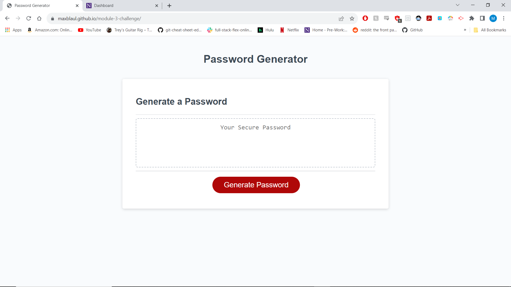

# module-3-challenge
Repo for Module 3 Homework

For this homework I had to make a random password generator using JS. 
I understood what was going on and what pseudo-code and steps i needed to include. However i struggled a lot with the order
of things and the syntax of Javascript functions. I worked with both a tutor and Sam the teacher assistant. I was able to get
the results I needed after Sam helped me. Most of the ideas behind the code are present. I just need more practice with the overall
flow, arrangement and rules to JS. 

first i created a variables for all the numbers letters and symbols i wanted to include. i made them as string and then split them to express them as an array for easier writing. then i made the function get Random from the arrays above. this function returns random elements. then I set up if statements to gather criteria. I designate what happens when the user doesn't pick right. and then now long the password is. then the user has to click to confirm their choices. if they choose nothing, it returns null. once things are selected by user, it logs the criteria in the console log. and then the if statements retrieve the possible and guaranteed characters from the criteria log and pushed is it to get random function to select random characters and arrange them in no order. it then checks guranteed vs possible chracters and seperates the guarunteed into result. 

